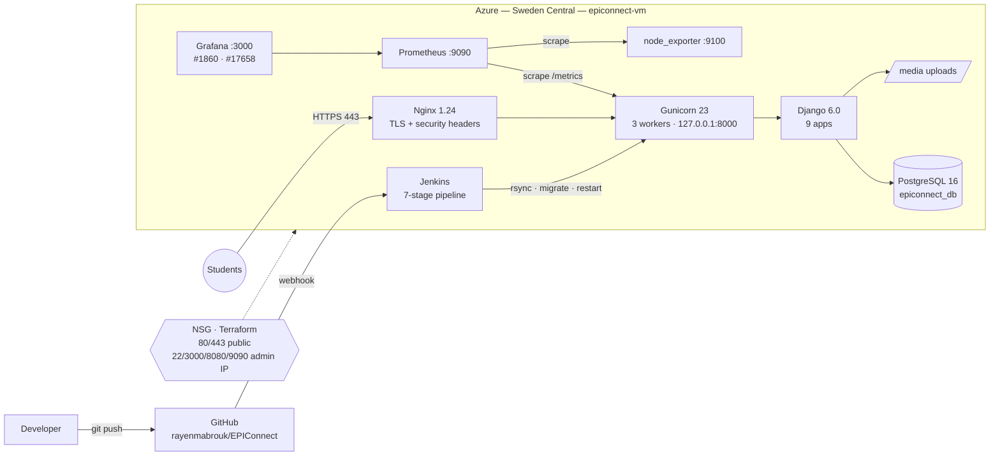

# EPIConnect

**A campus community platform for EPI Digital School students, deployed on Microsoft Azure with a DevSecOps pipeline.**

Students report lost and found items, buy and sell in a marketplace, ask for help on an anonymous-friendly Help Wall, message each other in real time, and earn **EPI-points** they can redeem for campus perks.


| | |
|---|---|
| **Author** | Rayen Mabrouk ([@rayenmabrouk](https://github.com/rayenmabrouk)) |
| **Context** | PFA (Projet de Fin d'Année), 2025–2026, EPI Digital School, Sousse, Cloud Computing & Networks engineering program |
| **Live URL** | https://epiconnect.swedencentral.cloudapp.azure.com |
| **Hosting** | Azure VM `epiconnect-vm` (Standard_B2ts_v2, Ubuntu 24.04 LTS, Sweden Central) |

---

## Table of contents

1. [Features](#features)
2. [Architecture](#architecture)
3. [Tech stack](#tech-stack)
4. [Repository layout](#repository-layout)
5. [Run it locally](#run-it-locally)
6. [Tests & security scans](#tests--security-scans)
7. [Documentation](#documentation)

---

## Features

| Module | What it does |
|---|---|
| **Accounts** | Registration with a unique student ID, profiles with avatar and bio. An admin verifies each student before they can post. |
| **Lost & Found** | Report lost or found items with a photo, location and date. Status workflow `lost → found → claimed → archived` with a full history timeline. |
| **Marketplace** | Buy and sell listings by category, with search and price sorting. |
| **Help Wall** | Posts, comments and likes (AJAX), with optional **anonymous** posting. |
| **Messaging** | 1-to-1 conversations with image attachments and 3-second polling. |
| **Notifications** | Likes, comments, messages and item alerts, shown in a navbar dropdown and on a full page. |
| **Wallet & gamification** | EPI-points ledger, 5 badges, a monthly leaderboard and a perks shop with stock management. |
| **Security dashboard** | Superuser-only view of the audit log, failed logins and axes lockouts (`/security/dashboard/`). |

Full description: [docs/FEATURES.md](docs/FEATURES.md)

## Architecture




More detail in [docs/ARCHITECTURE.md](docs/ARCHITECTURE.md): request flow, data model and design decisions.

## Tech stack

| Layer | Technology |
|---|---|
| Backend | Python 3.12, Django 6.0.8, 9 apps, 17 models |
| Frontend | Django templates, Tailwind CSS (CDN), vanilla JS (AJAX likes, chat polling, notification dropdown) |
| Database | PostgreSQL 16 (production), SQLite (local/tests) |
| App server | Gunicorn 23 (systemd), WhiteNoise for static files |
| Reverse proxy | Nginx 1.24, Let's Encrypt TLS |
| Cloud | Microsoft Azure (Azure for Students): VM, NSG, Defender for Cloud, Blob Storage |
| IaC | Terraform (azurerm ~> 4.0): Network Security Group |
| CI/CD | Jenkins with a GitHub webhook and a 7-stage declarative pipeline |
| Security | django-axes, django-ratelimit, custom audit log, Bandit (SAST), pip-audit (SCA) |
| Monitoring | Prometheus 2.52, node_exporter, django-prometheus, Grafana (dashboards #1860 and #17658) |

## Repository layout

```
EPIConnect/
├── epiconnect/          # Project settings, URLs, WSGI
├── core/                # Home page, /healthz/, /metrics, shared utils (client IP)
├── users/               # Custom User, StudentProfile, auth, verification gate
├── lostfound/           # Item, ItemHistory
├── marketplace/         # Listing
├── social/              # Help Wall: Post, Comment, Like
├── messaging/           # Conversation, Message
├── notifications/       # Notification
├── wallet/              # Wallet, Transaction, Badge, Perk, Redemption
├── auditlog/            # AuditLog + security dashboard
├── templates/           # All HTML templates (Tailwind)
├── deploy/
│   ├── nginx/           # epiconnect.conf (TLS, headers, /media, /metrics deny)
│   ├── systemd/         # gunicorn.service
│   ├── monitoring/      # prometheus.yml, Grafana datasource provisioning
│   └── scripts/         # backup_db.sh (PostgreSQL + media → Azure Blob)
├── infra/terraform/     # NSG as code
├── docs/                # Documentation, diagrams, scan reports
├── Jenkinsfile          # CI/CD pipeline
├── requirements.txt     # Runtime dependencies
└── requirements-dev.txt # + Bandit, pip-audit
```

## Run it locally

Requires **Python 3.12+** (Django 6 does not support 3.11).

```bash
git clone https://github.com/rayenmabrouk/EPIConnect.git
cd EPIConnect
python3.12 -m venv venv && source venv/bin/activate      # Windows: venv\Scripts\activate
pip install -r requirements-dev.txt

echo "DEBUG=True" > .env        # SQLite + auto-generated dev secret key
python manage.py migrate
python manage.py seed_perks      # 8 default campus perks
python manage.py createsuperuser
python manage.py runserver
```

Open http://127.0.0.1:8000. New accounts must be verified before they can post. In `/admin/`, go to **Student profiles**, select the account and run **Verify selected students**.

## Tests & security scans

```bash
python manage.py test                                       # 50 tests, all apps
bandit -r . -x ./venv,./staticfiles,./media                 # SAST  → 0 issues
pip-audit -r requirements.txt                               # SCA   → 0 known CVEs
python manage.py check --deploy                             # Django deployment checklist
```

Jenkins runs all of these on every push (see [docs/CICD.md](docs/CICD.md)). The latest reports are in [docs/reports/](docs/reports/).

## Documentation

| Document | Contents |
|---|---|
| [ARCHITECTURE.md](docs/ARCHITECTURE.md) | Components, request flow, data model (UML), design decisions |
| [FEATURES.md](docs/FEATURES.md) | Every module, its URLs, and the points and badges rules |
| [DEPLOYMENT.md](docs/DEPLOYMENT.md) | Step-by-step Azure VM deployment, from zero to HTTPS |
| [CICD.md](docs/CICD.md) | Jenkins setup, webhook, and the 7 pipeline stages |
| [SECURITY.md](docs/SECURITY.md) | The 14+ security measures, threat model, and scan results |
| [MONITORING.md](docs/MONITORING.md) | Prometheus, node_exporter, django-prometheus, Grafana dashboards |
| [TROUBLESHOOTING.md](docs/TROUBLESHOOTING.md) | Real problems hit during the project and how they were fixed |
| [SCREENSHOTS.md](docs/SCREENSHOTS.md) | Checklist of the screenshots that illustrate the report |
| [CHANGELOG.md](docs/CHANGELOG.md) | Version history |

---

© 2026 Rayen Mabrouk. Academic project, EPI Digital School.
