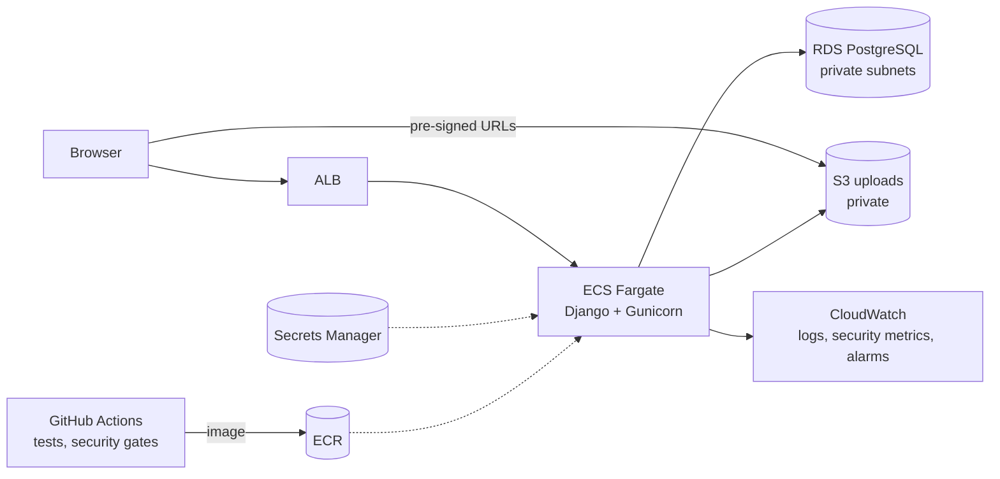

# EPIConnect

**A campus community platform, modernised from a single Azure VM to a containerised, security-gated deployment on AWS.**

[](https://github.com/rayenmabrouk/EPIConnect/actions/workflows/pipeline.yml)
[](https://github.com/rayenmabrouk/EPIConnect/actions/workflows/codeql.yml)

Students report lost and found items, buy and sell on a marketplace, ask for help on a Q&A wall (anonymously if they want), chat, and earn points and badges for helping each other. Only students whose ID has been verified by an administrator can post.

Django 6 · PostgreSQL · Docker · AWS ECS Fargate · RDS · S3 · Terraform · GitHub Actions

---

## Architecture



Why these services, the request path, and the trade-offs: [docs/ARCHITECTURE.md](docs/ARCHITECTURE.md). The lab deployment is served over HTTP because AWS Academy blocks CloudFront and the project has no domain for a certificate; see [HTTPS](docs/ARCHITECTURE.md#https-why-the-lab-deployment-is-http).

## What this project demonstrates

| Area | Highlights |
|---|---|
| **Modernisation** | Audited a broken codebase (it did not start), fixed it, and moved it from VM + systemd + Jenkins to immutable containers on ECS Fargate with RDS and S3, working within AWS Academy's restrictions |
| **DevSecOps** | Pipeline gates: gitleaks, Bandit, CodeQL, pip-audit, npm audit, Checkov, hadolint, zizmor, Trivy (+ SBOM), OWASP ZAP against the running container; hash-pinned dependencies and SHA-pinned actions |
| **Application security** | Fixed a spoofable-IP rate-limit/lockout bypass, stored XSS via uploads, a wallet race condition and points-farming flaws, each with a regression test; nonce-based CSP |
| **Delivery** | Build once, deploy the same image: ECR -> migration as a one-off task -> rolling update -> smoke test -> automatic rollback |
| **Operations** | Structured JSON logs turned into CloudWatch security metrics and alarms; dashboard; one-click destroy/recreate for cost control |

## Verified on AWS (24 September 2026)

- **Infrastructure** applied from the Infrastructure workflow (VPC, ALB, ECS Fargate, RDS PostgreSQL 17, ECR, Secrets Manager, CloudWatch alarms and dashboard) in the AWS Academy account.
- **CI/CD** on `main`: tests on PostgreSQL, all security gates, image build, Trivy, container run test and ZAP baseline passed; image pushed to ECR; migrations ran as a one-off Fargate task; rolling deploy and smoke test passed.
- **Ops workflow**: `bootstrap_admin` and `seed_perks` ran as one-off tasks.
- **Live end-to-end check** against the deployed URL: registration (RDS), login (session + CSRF), profile-picture upload to S3 through the task role, and the pre-signed image URL loading under the Content-Security-Policy.
- **Torn down** afterwards with the Infrastructure workflow (`destroy`) to save lab credit. Only the tiny Terraform state bucket remains. Recreate: Infrastructure -> `apply`, then CI/CD -> run workflow, then Ops -> `bootstrap_admin` ([runbook](docs/RUNBOOK.md#first-deployment-to-aws-aws-academy)).

## Related project

My other project, [CloudPulse](https://github.com/rayenmabrouk/cloudpulse), is the complement: an existing open-source app with AWS infrastructure (EC2, Terraform modules, Prometheus/Grafana) built around it.

## Run it

```bash
docker compose up --build    # http://localhost:8000
```

Deploying to AWS, operations, rollback, cost control and troubleshooting: [docs/RUNBOOK.md](docs/RUNBOOK.md).

## Repository layout

| Path | Contents |
|---|---|
| `users/ lostfound/ marketplace/ social/ messaging/ notifications/ wallet/ auditlog/ core/` | Django apps |
| `epiconnect/settings.py` | Environment-driven settings (security headers, CSP, storage, logging) |
| `templates/`, `static/`, `frontend/` | Templates, JS, Tailwind build config |
| `Dockerfile`, `docker/`, `compose.yaml` | Container image and local environment |
| `infra/` | Terraform for the AWS environment |
| `.github/workflows/` | CI/CD, CodeQL, Infrastructure, Ops |
| `scripts/` | Deploy, one-off task, smoke test, container test, state bootstrap |
| `docs/` | Architecture and runbook |

## Documentation

- [Architecture](docs/ARCHITECTURE.md) - application, original deployment, AWS design, CI/CD, DevSecOps, monitoring, cost
- [Runbook](docs/RUNBOOK.md) - local run, deployment, rollback, observability, troubleshooting
- [Security policy](SECURITY.md)
