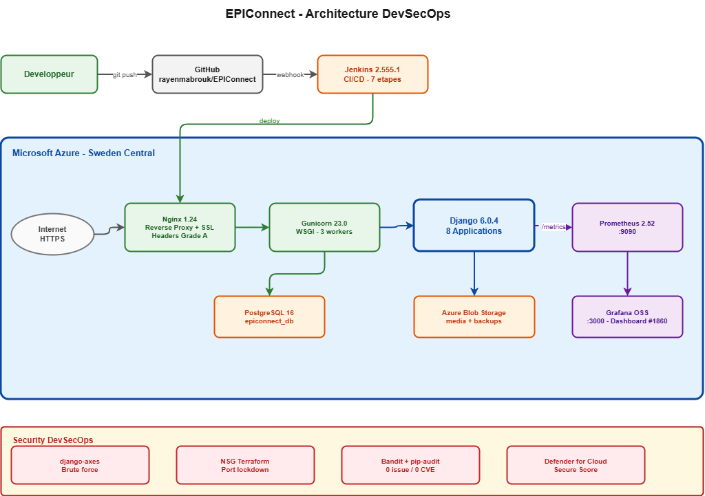
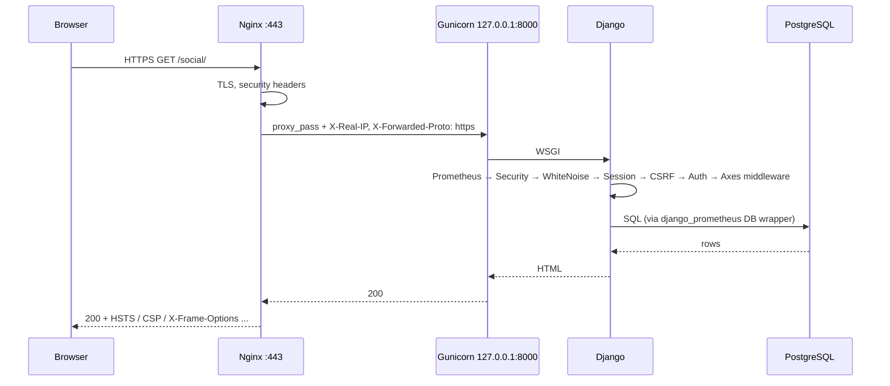
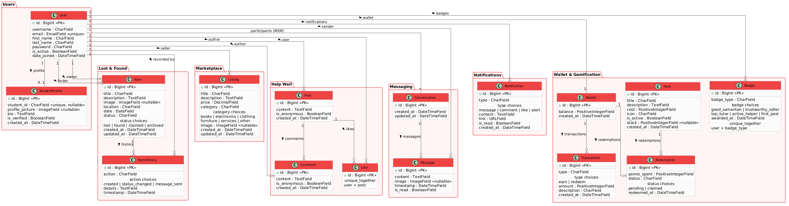
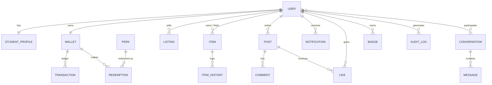

# Architecture

## 1. Overview

EPIConnect is a monolithic Django application on a single Azure VM. For a campus demo with light traffic, one well-secured VM costs less (about $9/month from the student credit), is simpler to operate, and is easier to explain than App Service with a managed DB or Kubernetes. Every component that matters for a production setup is still in place: a reverse proxy, TLS, a managed process, a relational DB, CI/CD, IaC, monitoring and security scanning.

## 2. Components

| Component | Version | Role | Listens on |
|---|---|---|---|
| Nginx | 1.24 | TLS termination, HTTP→HTTPS redirect, security headers, serves `/static/` and `/media/`, blocks `/metrics` | 80, 443 (public) |
| Gunicorn | 23.0 | WSGI server, 3 workers, managed by systemd | 127.0.0.1:8000 (loopback only) |
| Django | 6.0.8 | Application: 9 apps, 17 models | — |
| PostgreSQL | 16 | Database `epiconnect_db` | 127.0.0.1:5432 |
| Jenkins | 2.555.1 | CI/CD, triggered by a GitHub webhook | 8080 (admin IP + GitHub hooks) |
| Prometheus | 2.52 | Scrapes node_exporter and Django `/metrics` | 9090 (admin IP) |
| node_exporter | — | Host metrics (CPU, RAM, disk, network) | 9100 (loopback) |
| Grafana OSS | — | Dashboards #1860 (Node Exporter Full) and #17658 (Django) | 3000 (admin IP) |
| Azure NSG | — | Network firewall, managed with Terraform | — |
| Microsoft Defender for Cloud | — | Posture management, Secure Score | — |
| Azure Blob Storage | — | Off-VM backups of the DB dump and media archive | — |

### Azure resources

| Resource | Name / value |
|---|---|
| Subscription | Azure for Students |
| Resource group | `epiconnect-rg` |
| Region | Sweden Central (the only region allowed by the subscription policy; see [TROUBLESHOOTING](TROUBLESHOOTING.md#1-azure-region-blocked-by-policy)) |
| VM | `epiconnect-vm`: Standard_B2ts_v2 (2 vCPU, 1 GiB), Ubuntu Server 24.04 LTS, admin user `rayen9` |
| Public IP | `4.223.163.106` with DNS `epiconnect.swedencentral.cloudapp.azure.com` |
| NSG | `epiconnect-vm-nsg` (Terraform: [`infra/terraform`](../infra/terraform)) |

## 3. Request flow

Key points:
- **Gunicorn is never exposed.** It binds to loopback, and the old testing port 8000 is closed in the NSG.
- **Real client IP.** Nginx overwrites `X-Real-IP` with `$remote_addr`, and `core.utils.get_client_ip` reads it. django-axes, django-ratelimit and the audit log all use this function, so a client can't spoof its IP with `X-Forwarded-For`.
- **HTTPS awareness.** `SECURE_PROXY_SSL_HEADER` trusts Nginx's `X-Forwarded-Proto`, so Django knows the request was HTTPS. This keeps secure cookies and the CSRF origin check working.

## 4. Django apps

| App | Models | Responsibility |
|---|---|---|
| `users` | User (custom, unique email), StudentProfile | Auth, profiles, `VerifiedStudentMixin` |
| `core` | — | Home page with stats, `/healthz/`, `/metrics`, shared helpers |
| `lostfound` | Item, ItemHistory | Lost & found with a status state machine |
| `marketplace` | Listing | Buy and sell listings |
| `social` | Post, Comment, Like | Help Wall |
| `messaging` | Conversation, Message | Private chat |
| `notifications` | Notification | In-app notifications |
| `wallet` | Wallet, Transaction, Badge, Perk, Redemption | Gamification and perks |
| `auditlog` | AuditLog | Security event log and dashboard |

## 5. Data model

Notable constraints:
- `StudentProfile.student_id` is unique. The profile is created by a `post_save` signal on `User`.
- `Like (user, post)` and `Badge (user, badge_type)` are `unique_together`, so there are no duplicate likes or badges.
- `Transaction (wallet, reference)` is unique. It is the idempotency key that stops point farming (see [SECURITY](SECURITY.md)).
- `Wallet.balance` is only changed with atomic SQL (`F()` expressions) inside a transaction. Redemptions lock the wallet and perk rows (`select_for_update`).

## 6. Design decisions

| Decision | Alternatives considered | Why |
|---|---|---|
| Single VM | App Service, AKS | Student credit budget, full control of Nginx and headers, and it shows Linux admin skills. Light demo traffic only. |
| Sweden Central | France Central, West Europe, East US | Imposed: the Azure for Students policy only allowed Sweden Central for VMs. |
| Gunicorn with 3 workers | Uvicorn/ASGI | No websockets needed (chat uses polling), and the classic WSGI stack is well understood. 3 workers = 2×vCPU−1. |
| Polling chat (3 s) | Django Channels + Redis | No extra services to run on a 1 GiB VM. Good enough for a demo. |
| Tailwind CDN | Tailwind CLI build | No Node build step. Trade-off: the CSP needs `'unsafe-inline'` for scripts. |
| LocMem cache | Redis | Nothing extra to run. Trade-off: rate limits count per Gunicorn worker. |
| Jenkins on the VM | GitHub Actions | Required by the course (DevOps module). The pipeline deploys locally without SSH keys in CI. |
| Terraform only for the NSG | Full VM in Terraform | The VM was created in the portal during region trial-and-error. The NSG is the security-critical part, so it is the part under code. |
