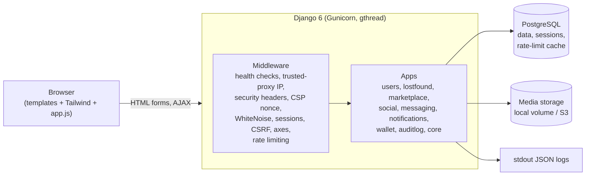
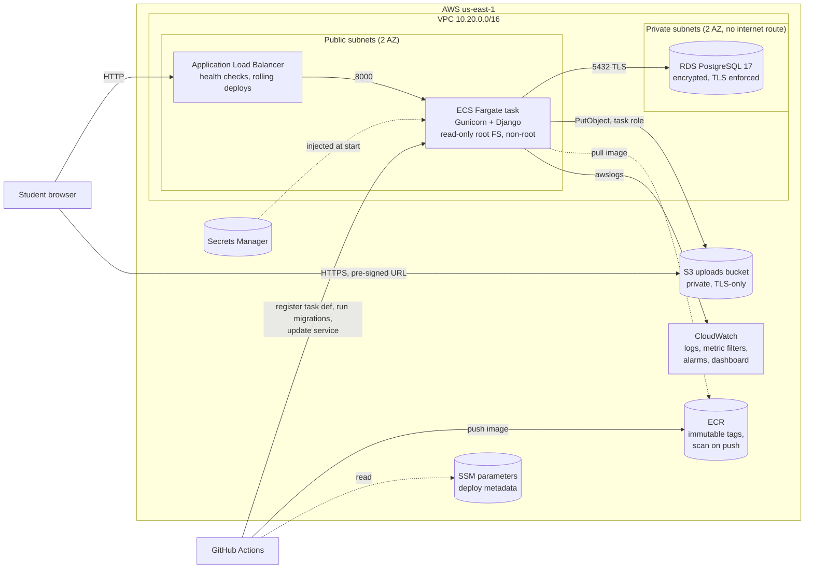
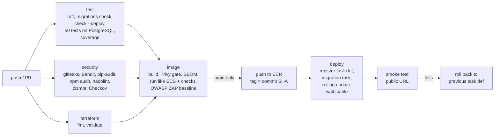

# EPIConnect - Architecture

Last updated: 2026-09-24

## 1. What EPIConnect is

EPIConnect is a community platform for university students. It is a server-rendered Django 6 application with nine apps:

| App | What it does |
|---|---|
| `users` | Registration with a student ID, login, profiles. An admin verifies each student ID; unverified accounts can browse but not post |
| `lostfound` | Report lost/found items with a photo, a status workflow (lost -> found -> claimed -> archived) and a history timeline |
| `marketplace` | Buy/sell listings (books, electronics, services...) with search, category filter and price sort |
| `social` | "Help Wall": posts (optionally anonymous), comments, likes |
| `messaging` | One-to-one chat with image messages (AJAX polling every 3 s) |
| `notifications` | In-app notifications (messages, comments, likes, item status changes) |
| `wallet` | Gamification: EPI-points for contributions, badges, a monthly leaderboard, perks redeemable with points |
| `auditlog` | Security audit trail (logins, failures, lockouts, content changes) and a superuser security dashboard |
| `core` | Home page, health checks, infrastructure middleware |

17 models in PostgreSQL. No separate front-end framework: Django templates, Tailwind CSS and a small amount of vanilla JavaScript.

### Project scope

This project focuses on the engineering *around and on top of* the application: defining what the platform must do, choosing the architecture and the technologies, and taking the application from a single hand-configured Azure VM to a containerised, secured, monitored AWS deployment with an automated delivery pipeline, then operating and explaining that system. The modernisation work is described in sections 4-8.

CloudPulse (Rayen's other project) is the mirror image: an existing open-source application (dpaste) with infrastructure built around it. EPIConnect is the "own product, modernised and secured" story.

## 2. Application architecture

Request flow inside the container:

1. `HealthCheckMiddleware` answers `/healthz/` (liveness, no I/O) and `/readyz/` (database `SELECT 1`) before host validation, because the load balancer's health checker uses the task's private IP as the `Host` header.
2. `TrustedProxyMiddleware` replaces `REMOTE_ADDR` with the real client IP taken from `X-Forwarded-For`, trusting only the right-most `TRUSTED_PROXY_COUNT` hops (1 on AWS: the ALB). Everything below (axes lockouts, rate limits, audit log) sees a non-spoofable client IP.
3. Django security middleware: HTTPS redirect, HSTS, `nosniff`, referrer policy, COOP, and a nonce-based Content-Security-Policy (Django 6 built-in).
4. WhiteNoise serves hashed, pre-compressed static files baked into the image.
5. Sessions, CSRF, authentication, django-axes (lock after 5 failures), django-ratelimit (per-IP on login/register, per-user on content creation; counters in the database so every worker and every task shares them).

Views are ordinary Django class-based views. Business rules that matter for security live in code, not templates: student verification (`VerifiedStudentMixin`), ownership checks on update/delete, idempotent point awards (`wallet.Transaction.reference`), row-locked perk redemption.

## 3. The original deployment (Azure)

Until this modernisation EPIConnect ran on one Azure VM (Standard_B2ts_v2, Ubuntu 24.04, Sweden Central):

- Nginx (TLS via Let's Encrypt) -> Gunicorn (systemd) -> PostgreSQL, all on the same VM
- Jenkins on the same VM: a pipeline that copied the workspace into `/var/www/EPIConnect`, ran `pip install`, `migrate`, `collectstatic`, then `sudo systemctl restart gunicorn`
- Prometheus + Grafana on the VM, an NSG restricting admin ports, Azure Backup of the VM

Problems found when the repository was audited (September 2026):

| Problem | Impact |
|---|---|
| Unresolved git merge-conflict markers in `users/views.py` on `main` | The application did not start |
| `requirements.txt` not installable (django-prometheus pinned to Django < 6) and development tools (bandit, pip-audit) mixed into production dependencies | No clean install possible |
| Uploaded files served only when `DEBUG=True` | Every profile/item/listing photo was broken in production |
| Chat image upload wrote `request.FILES` straight to the model | Any file type (e.g. an HTML page) could be uploaded and served from the site's origin: stored XSS |
| Rate limiting keyed on the raw `X-Forwarded-For` header; audit log took its left-most value | Lockout and rate limits bypassable by sending a fake header; audit log IPs forgeable. Without the header, all users shared one bucket |
| Rate-limit counters in per-process memory (Django's default cache) | Each Gunicorn worker had its own counters |
| Wallet balance updated with read-modify-write, redemption without locking | Concurrent requests could double-spend points or take the last unit of a perk twice |
| Like/unlike toggling and status flipping re-awarded points every time | Points farming |
| Notification dropdown built with `innerHTML` from user-supplied text | DOM XSS sink |
| Tailwind "Play CDN" script compiling CSS in the browser | Third-party script on every page, not intended for production, blocks a strict CSP |
| Verified students could edit their student ID | Verification bypass |
| Hard-coded fallback `SECRET_KEY`, Azure host names in the Jenkinsfile | Unsafe defaults, environment coupling |
| Everything on one VM (app, DB, CI server, monitoring) | One failure domain, manual patching, pets not cattle |

An earlier, unmerged branch (`v1.1-audit-fixes-docs`) had already fixed several of the application bugs for the Azure setup. Its idempotent-reward approach was reused; its Nginx/systemd/Jenkins/NSG work is superseded by this AWS design.

## 4. AWS architecture

Live URL during the demo: `http://epiconnect-alb-<id>.us-east-1.elb.amazonaws.com` (Terraform output `app_url`, SSM parameter `/epiconnect/deploy/app_url`).

### What each piece is for

| Service | Role | Why this and not something else |
|---|---|---|
| **ECS on Fargate** | Runs the Django container (1 task, 0.25 vCPU / 512 MiB) | See section 5 |
| **Application Load Balancer** | Public entry point, health checks, zero-downtime rolling deploys | Fargate task IPs change on every deploy; something must track them. The ALB is the one fixed cost that buys that |
| **RDS PostgreSQL 17** (db.t4g.micro, single-AZ, gp2) | Application data, sessions, rate-limit counters | Managed backups, patching, encryption. Private subnets, only reachable from the task security group, `rds.force_ssl=1` |
| **S3** (private) | User uploads (profile pictures, item/listing/chat photos) | Containers are disposable; uploads on local disk would vanish on the next deploy. Django writes with the task role and hands browsers **pre-signed URLs valid for 1 hour**: nothing is public, and user content is served from a different origin than the application |
| **ECR** | Image registry | Immutable tags (a tag = a commit SHA forever), scan on push, lifecycle keeps 15 images |
| **Secrets Manager** | `SECRET_KEY`, DB password, initial admin password (one JSON secret) | ECS injects the values into the container at start; they are not in the image, the task definition, the repository or the pipeline logs |
| **SSM Parameter Store** | Non-secret deploy metadata written by Terraform (cluster, service, subnets, URL...) | The pipeline reads them at run time: no ARNs or IDs hard-coded in CI |
| **CloudWatch** | Logs, metrics, alarms, dashboard | Section 9 |

### Network and access control

- **The ALB is the only internet-facing component** (port 80).
- **Only the ALB can reach the task** (security group reference, port 8000). The task's outbound traffic is limited to HTTPS (AWS APIs) and PostgreSQL to the DB security group.
- **Only the task can reach the database** (security group reference, 5432). The DB subnets have no route to the internet.
- **No NAT gateway.** Tasks run in public subnets with a public IP purely for outbound calls to ECR, S3, CloudWatch Logs and Secrets Manager (a NAT gateway would cost ~$32/month; VPC interface endpoints ~$7/month each). Inbound is still restricted to the ALB.
- The default security group of the VPC is emptied so nothing can use it by accident.
- Client IP: the ALB appends the address it saw to `X-Forwarded-For`; Django trusts exactly one hop (`TRUSTED_PROXY_COUNT=1`), so a forged header cannot bypass lockouts or rate limits.

### HTTPS: why the lab deployment is HTTP

HTTPS needs a TLS certificate. On AWS that is either an ACM certificate for a domain name on the ALB, or CloudFront's default `*.cloudfront.net` certificate. This project has no domain, and **AWS Academy denies `cloudfront:CreateDistribution`** (found when the first design, CloudFront in front of the ALB, was applied). So the lab deployment serves plain HTTP on the ALB's DNS name, and the task definition explicitly switches off the HTTPS-only settings (`SECURE_SSL_REDIRECT`, `Secure` cookies, HSTS). The application itself is HTTPS-ready: the defaults are secure, CI runs Django's deployment checklist with them, and `SECURE_PROXY_SSL_HEADER` reads the ALB's `X-Forwarded-Proto`.

Production (or the lab with a domain): an ACM certificate (DNS validation), an HTTPS listener on 443, the port-80 listener turned into an HTTP->HTTPS redirect, and the three environment overrides removed. Uploads already travel over HTTPS (pre-signed S3 URLs, TLS-only bucket policy).

### AWS Academy constraints

The deployment runs in an AWS Academy Learner Lab ($50 credit), which shaped a few choices:

| Constraint | Consequence |
|---|---|
| Only `us-east-1` / `us-west-2` | `us-east-1` |
| CloudFront denied (`CreateDistribution`, `CreateOriginAccessControl`, `List*Policies`) | No CDN; HTTP on the ALB (see above); uploads via pre-signed S3 URLs instead of CloudFront + OAC |
| Service control policy denies `s3:GetBucketObjectLockConfiguration`, which the Terraform AWS provider reads for every bucket | Both buckets (state, uploads) are created and hardened by `scripts/bootstrap-buckets.sh` (AWS CLI) instead of Terraform |
| No IAM role or OIDC provider creation | Tasks use the pre-created `LabRole`; GitHub Actions uses the lab's short-lived session credentials (refreshed per lab session with `scripts/refresh-github-aws-secrets.ps1`). `infra/iam.tf` contains the least-privilege execution and task roles used automatically in a normal account (`lab_role_name = ""`); that path is validated but was not deployable in the lab |
| RDS: no Multi-AZ, no enhanced monitoring / Performance Insights, gp2 only | Single-AZ gp2 instance |
| Credits are finite | Everything is destroyable with one workflow run and re-creatable in ~15 minutes |

## 5. Why ECS Fargate (and not EC2, App Runner, Lambda or Kubernetes)

The decision followed from what the application needs once it is containerised: one stateless web process, a PostgreSQL database, durable storage for uploads, HTTPS, and a way to run one-off commands (migrations).

| Option | Verdict |
|---|---|
| **ECS on Fargate** | **Chosen.** Once uploads move to S3 the app is stateless, which is exactly what Fargate runs well: no server to patch, rolling deploys with health checks and automatic rollback (deployment circuit breaker), one-off tasks for migrations with the same image and secrets, per-task IAM role. Cost for one small task is ~$9/month |
| EC2 + Docker | Works (CloudPulse does this), but means patching an OS, managing Docker on the host, and writing the rollout/rollback logic yourself. It would also make the two portfolio projects identical |
| AWS App Runner | Closed to new customers since 30 April 2026 |
| Lambda (container image + Web Adapter) | Cheaper at zero traffic, but a Django monolith with polling chat, DB connection management per invocation and cold starts is fighting the platform |
| EKS | $73/month for the control plane alone and far more operational surface than one service needs |
| Elastic Beanstalk / Lightsail | Would hide most of the engineering this project is meant to show |

## 6. What was modernised

| Area | Before (Azure VM) | After (AWS) |
|---|---|---|
| Runtime | Gunicorn under systemd on a VM | Immutable container on ECS Fargate, non-root, read-only root FS |
| Build | `pip install` on the server during deploy | Multi-stage Dockerfile, hash-verified dependencies, static files and compiled CSS baked in |
| Database | PostgreSQL on the same VM | RDS, private subnets, encrypted, TLS required, automated backups |
| Uploads | VM disk, not served in production | S3 (private), pre-signed URLs |
| Secrets | `.env` file on the VM | Secrets Manager, injected by ECS at task start |
| HTTPS | Nginx + Let's Encrypt | Not possible in the lab without a domain or CloudFront (section 4); app is HTTPS-ready |
| Deploy | Jenkins copied files and restarted systemd | GitHub Actions: image -> scans -> ECR -> migration task -> rolling update -> smoke test -> rollback |
| Migrations | Run by every deploy on the live server | One-off Fargate task before the new version gets traffic; failure stops the deploy |
| Infrastructure | Hand-built VM (+ NSG in Terraform on a branch) | Terraform: VPC, ALB, ECS, RDS, ECR, secrets, monitoring; buckets by script |
| Monitoring | Prometheus + Grafana on the VM | CloudWatch: logs, security metrics from logs, alarms, dashboard |
| Front-end assets | Tailwind compiled in the browser from a CDN | Compiled at build time, served by WhiteNoise, strict CSP |
| Local environment | SQLite | `docker compose up`: same image, PostgreSQL, read-only container |

**Jenkins was removed, not ported.** It needed a long-running server with SSH/sudo access to the host it deployed to. With an immutable image and ECS there is nothing to copy onto a host, and maintaining two CI systems would have no benefit. The Jenkinsfile stays in git history.

**Prometheus/Grafana was dropped for this deployment.** On the VM they monitored the host and a `/metrics` endpoint. On Fargate there is no host to monitor, ALB/ECS/RDS metrics are native in CloudWatch, and running Prometheus + Grafana would mean extra always-on containers with persistent storage (cost, and a second stateful system to secure) for one small service. CloudPulse already demonstrates a Prometheus/Grafana stack. What is lost: per-view latency histograms from inside Django; the upgrade path is CloudWatch Embedded Metric Format or an ADOT sidecar sending to Amazon Managed Service for Prometheus.

**Terraform is deliberately small** (one flat configuration in `infra/`, no modules): it describes the environment so it can be destroyed and recreated, while the day-to-day delivery work lives in the pipeline. Terraform owns everything in the task definition except the image; the pipeline registers new revisions with the new image (`lifecycle.ignore_changes` on the service's task definition and desired count).

## 7. CI/CD

Three workflows plus Dependabot:

- **`.github/workflows/pipeline.yml` (CI/CD)** - on every pull request and push to `main`. Pull requests run all gates without touching AWS. On `main`, the image that passed the gates is the exact image pushed and deployed (built once, tagged with the commit SHA, immutable in ECR).
- **`.github/workflows/codeql.yml`** - CodeQL semantic analysis for Python, JavaScript and the workflows themselves; results in the GitHub Security tab; weekly re-scan.
- **`.github/workflows/infra.yml` (Infrastructure)** - Terraform plan on pull requests touching `infra/`; manual `plan`, `apply` (applies exactly the saved plan) or `destroy`. Kept separate from app delivery on purpose: infrastructure changes are rare and reviewed, app deploys are routine.
- **`.github/workflows/ops.yml`** - one-off management commands in a Fargate task (`bootstrap_admin`, `seed_perks`, `migrate`).
- **Dependabot** - weekly updates for pip, npm, Docker base images, GitHub Actions and Terraform providers; every update PR goes through the same gates.

### How a deployment works (`scripts/ecs-deploy.sh`)

1. Read cluster/service/subnets from SSM (written by Terraform).
2. Take the latest task definition revision, swap in the new image, register a new revision.
3. Run `migrate` as a **one-off Fargate task** with the new revision. If it fails, stop: the service is untouched and the old version keeps serving.
4. Update the service. ECS starts a new task, waits for the ALB health check (`/healthz/`), then drains the old task (min healthy 100 %, max 200 %): no downtime.
5. If the new task never becomes healthy, the **deployment circuit breaker** rolls back automatically; the script detects it and fails the job.
6. `scripts/smoke-test.sh` checks the public URL: health, readiness (DB), pages, login redirect, CSP/X-Frame-Options/nosniff/HttpOnly cookie, hashed static files (plus HTTPS redirect, HSTS and `Secure` cookies when the URL is `https://`).
7. If the smoke test fails, the workflow points the service back at the previous task definition.

## 8. DevSecOps and security

Every control below exists because of a concrete risk in this application or its delivery path.

### In the pipeline

| Control | Tool | Risk it addresses | Gate |
|---|---|---|---|
| Secret scanning of the whole git history | gitleaks | Credentials committed now or in the past | Blocks |
| SAST (patterns) | Bandit | Dangerous Python (shell, eval, weak crypto, hard-coded secrets) | Blocks on any finding |
| SAST (data flow) | CodeQL `security-extended` | Untrusted input reaching sinks: XSS, SQLi, open redirect, path injection - in Python **and** the JavaScript | Security tab |
| Dependency vulnerabilities | pip-audit (`--strict`), npm audit | Known CVEs in libraries. pip-audit caught vulnerable `sqlparse` and `urllib3` during this work | Blocks |
| Supply-chain integrity | `pip install --require-hashes`, lock files | A tampered or substituted package | Install fails |
| Pipeline security | zizmor, Checkov (GitHub Actions), SHA-pinned actions, `permissions: contents: read` by default, `persist-credentials: false` | Script injection, over-privileged tokens, a moved/compromised action tag | Blocks |
| IaC misconfiguration | Checkov (Terraform, Dockerfile) | Public buckets, open security groups, unencrypted storage... 36 findings accepted with a written reason next to the resource (`#checkov:skip=...:why`) | Blocks on anything new |
| Dockerfile lint | hadolint | Unpinned/unsafe image build patterns | Blocks on warnings |
| Container image scan | Trivy (OS packages + libraries + secrets) | Vulnerable packages in the shipped image | Blocks on fixable HIGH/CRITICAL; full SARIF report to the Security tab |
| SBOM | Trivy, CycloneDX | Knowing what is inside every released image | Artifact, 90 days |
| Runtime checks | `scripts/ci-container-test.sh` | Image only works as root / with a writable FS / without its health check | Blocks |
| DAST | OWASP ZAP baseline against the running container | Missing headers, cookie flags, error disclosure. Rules this project relies on are set to FAIL in `.zap/rules.tsv` | Blocks on those rules |
| Deployment checklist | `manage.py check --deploy --fail-level WARNING` with production settings | Insecure Django settings | Blocks |
| Post-deploy verification | `scripts/smoke-test.sh` | A deployment that is up but misconfigured | Fails + rollback |

### AWS credentials and secrets

- **CI -> AWS:** in AWS Academy, OIDC is impossible, so GitHub Actions uses the lab's session credentials stored as encrypted repository secrets. They expire when the lab session ends (hours), which limits the blast radius. In a normal account these three secrets are replaced by an IAM role assumed through GitHub OIDC, trusted only for `repo:rayenmabrouk/EPIConnect:ref:refs/heads/main` / the `production` environment - no long-lived keys at all.
- **App -> AWS:** no keys. The task role provides temporary credentials to boto3 (S3 uploads).
- **Application secrets:** generated by Terraform (`random_password`), stored in Secrets Manager, injected by the ECS agent. They are in the Terraform state, which lives in a private, encrypted, versioned, TLS-only S3 bucket (`scripts/bootstrap-buckets.sh`).
- **First admin account:** `bootstrap_admin` runs as a one-off task and reads the password from Secrets Manager itself, so it never appears in an environment variable, task definition override or log.

### In the application

| Control | Where |
|---|---|
| Brute-force protection: lock username/IP after 5 failures for 1 h | django-axes |
| Rate limits: login 10/min/IP, register 5/min/IP, posts/items/listings 5/min/user, comments 10/min, likes 30/min, chat 30/min; HTTP 429 | django-ratelimit, DB-backed cache |
| Non-spoofable client IP for all of the above and the audit log | `core/middleware.py` |
| Upload validation: extension allow-list, 5 MB limit, Pillow image verification, random file names | `core/validators.py`, `messaging/forms.py` |
| Strict CSP with per-request nonce, no inline handlers, no third-party script | Django 6 CSP, `static/js/app.js` |
| HSTS (1 year), HTTPS redirect, `Secure`/`HttpOnly`/`SameSite` cookies, `X-Frame-Options: DENY`, `nosniff`, `Referrer-Policy`, COOP | `epiconnect/settings.py` |
| Authorization: owner checks on every update/delete, student verification for all contributions, superuser-only security dashboard | views, `users/mixins.py` |
| Business-logic integrity: row-locked redemption, SQL-side balance updates, idempotent rewards | `wallet/` |
| Open-redirect guard on notification links; escaped `innerHTML` | `notifications/views.py`, `app.js` |
| `SECRET_KEY` mandatory outside DEBUG; admin URL configurable | settings |
| Audit trail in the DB **and** as JSON log events | `auditlog/` |

### In the container and on AWS

Non-root uid 10001, read-only root filesystem (only `/tmp` writable), `init` process for signal handling, no shell needed at runtime; encrypted RDS/S3/ECR; TLS-only S3 bucket policies; public access blocked; private DB subnets; least-privilege security groups; immutable image tags; ECR scan on push.

## 9. Monitoring and logging

Everything the application writes goes to stdout as **one JSON object per line** (Django logs via `core/logging.py`, Gunicorn access logs via `docker/gunicorn.conf.py`) and is shipped by the `awslogs` driver to the log group `/ecs/epiconnect` (14-day retention). Because the logs are structured, CloudWatch can turn application events into metrics without an agent:

| Metric (namespace `EPIConnect`) | Source | Alarm |
|---|---|---|
| `FailedLogins` | `{ $.event = "audit" && $.action = "login_failed" }` | >= 20 in 5 min (brute force / credential stuffing) |
| `AccountLockouts` | django-axes lockout log lines | dashboard |
| `RateLimitedRequests` | access log `status = 429` | dashboard |
| `ApplicationErrors` | `{ $.level = "ERROR" }` | >= 5 in 5 min |

Native metrics and alarms: ALB `HealthyHostCount` < 1 for 3 min, target 5xx >= 10 in 5 min, ECS memory > 85 %, RDS CPU > 80 %, RDS free storage < 2 GB. Alarms publish to an SNS topic (optional e-mail subscription via `alarm_email`).

The `epiconnect` CloudWatch dashboard shows traffic and errors, p50/p95 latency, ECS CPU/memory, database CPU/connections, healthy targets, the security-event metrics, and a Logs Insights table of the latest audit events.

Health checks exist at three levels: the Docker/ECS container health check and the ALB target health check (`/healthz/`, liveness - a database outage should not make ECS kill healthy web containers), and `/readyz/` (database) in the smoke test.

## 10. Cost (us-east-1, running 24/7)

| Item | ~USD / month |
|---|---|
| Application Load Balancer (hourly; LCUs negligible at this traffic) | 16.4 |
| RDS db.t4g.micro + 20 GB gp2 | 14.0 |
| Fargate 0.25 vCPU / 0.5 GB, x86, 1 task | 9.0 |
| Public IPv4 addresses (2 for the ALB, 1 for the task) | 11.0 |
| Secrets Manager (1 secret), CloudWatch alarms/logs, ECR, S3 | ~2 |
| **Total** | **~$52 / month, ~$1.7 / day** |

Not used, on purpose: NAT gateway (~$32), EKS ($73), Multi-AZ RDS (x2), WAF (~$6+), Container Insights, KMS customer keys, VPC endpoints (~$7 each). On the $50 Academy budget the environment is created for demos and destroyed afterwards (`Infrastructure` workflow -> `destroy`; ~15 minutes to recreate).

## 11. What would change for a real production launch

1. **Identity:** GitHub OIDC role instead of lab credentials; separate least-privilege task and execution roles (`lab_role_name = ""` already does this); environment protection rules with required reviewers on `production` and `infrastructure`.
2. **Edge:** custom domain with an ACM certificate on the ALB (HTTPS listener, HTTP->HTTPS redirect, HSTS back on) or CloudFront in front; AWS WAF with the managed common rule set and rate-based rules; ALB access logs.
3. **Availability:** 2+ tasks across AZs with target-tracking autoscaling on CPU/request count; Multi-AZ RDS; deletion protection and final snapshots.
4. **Data:** Redis/Valkey (ElastiCache) for atomic rate limiting and caching; automated secret rotation; longer log retention; S3 replication for uploads.
5. **Network:** private subnets for tasks with VPC endpoints (or NAT); VPC flow logs.
6. **Observability:** application metrics (EMF or ADOT -> Amazon Managed Prometheus), X-Ray/OpenTelemetry tracing, on-call alert routing.
7. **Real-time chat:** WebSockets (Django Channels + ALB) instead of 3-second polling if usage grows.
