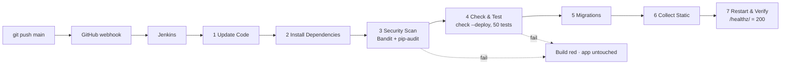

# CI/CD: Jenkins

Every `git push` to `main` triggers a GitHub webhook. Jenkins, running on the same VM, then scans, tests and deploys the new version, and only restarts the app once everything has passed.



## Pipeline stages ([`Jenkinsfile`](../Jenkinsfile))

| # | Stage | What it does | Fails the build if |
|---|---|---|---|
| 1 | **Update Code** | `rsync` the workspace into `/var/www/EPIConnect`, excluding `.git`, `.env`, `venv`, `media`, `staticfiles`. Deleted files are removed. Ownership is not preserved (`--no-owner --no-group`). | rsync error |
| 2 | **Install Dependencies** | `pip install -r requirements-dev.txt` into the project venv | a dependency can't be resolved |
| 3 | **Security Scan** | **Bandit** (SAST) on all Python code, **pip-audit** (SCA) on `requirements.txt`. Reports are archived as build artifacts. | any medium/high Bandit issue, or any known CVE |
| 4 | **Check & Test** | `manage.py check --deploy --fail-level WARNING`, `makemigrations --check`, `manage.py test` (50 tests on a throw-away SQLite DB) | any warning, missing migration, or failing test |
| 5 | **Run Migrations** | `manage.py migrate` on PostgreSQL | migration error |
| 6 | **Collect Static Files** | `collectstatic` (WhiteNoise manifest, compressed) | missing static file |
| 7 | **Restart & Verify** | `systemctl restart gunicorn`, then poll `http://127.0.0.1:8000/healthz/` up to 10 times | `/healthz/` never returns 200 |

On failure, the `post` block prints `systemctl status gunicorn` and the last 50 journal lines. The pipeline also has `disableConcurrentBuilds()` (two pushes never deploy at the same time), a 20-minute timeout, and keeps the last 20 builds.

## One-time Jenkins setup on the VM

```bash
# Java + Jenkins (LTS)
sudo apt install -y fontconfig openjdk-21-jre
sudo wget -O /usr/share/keyrings/jenkins-keyring.asc https://pkg.jenkins.io/debian-stable/jenkins.io-2023.key
echo "deb [signed-by=/usr/share/keyrings/jenkins-keyring.asc] https://pkg.jenkins.io/debian-stable binary/" \
  | sudo tee /etc/apt/sources.list.d/jenkins.list > /dev/null
sudo apt update && sudo apt install -y jenkins
sudo systemctl enable --now jenkins
sudo cat /var/lib/jenkins/secrets/initialAdminPassword
```

Open `http://4.223.163.106:8080` (your IP must be allowed by the NSG), install the suggested plugins, and create the admin user.

### Permissions (the fix for the "file ownership conflicts")

The `jenkins` user must be able to write to the project directory and restart Gunicorn, and nothing more:

```bash
# jenkins joins the shared group; the directory is setgid www-data (see DEPLOYMENT Part 4)
sudo usermod -aG www-data jenkins
sudo chgrp -R www-data /var/www/EPIConnect
sudo chmod -R g+rwX /var/www/EPIConnect
sudo find /var/www/EPIConnect -type d -exec chmod g+s {} +
sudo systemctl restart jenkins

# Minimal sudo rights
sudo visudo -f /etc/sudoers.d/jenkins
```

```
jenkins ALL=(root) NOPASSWD: /bin/systemctl restart gunicorn, /bin/systemctl status gunicorn --no-pager, /bin/journalctl -u gunicorn -n 50 --no-pager
```

Jenkins also has to read `.env` (stages 4–6 load it): `sudo chmod 640 .env && sudo chgrp www-data .env`.

### Job

1. **New Item** → `EPIConnect` → **Pipeline**.
2. **Build Triggers** → ✅ *GitHub hook trigger for GITScm polling*.
3. **Pipeline** → *Pipeline script from SCM* → Git → `https://github.com/rayenmabrouk/EPIConnect.git`, branch `*/main`, script path `Jenkinsfile`.

### GitHub webhook

Repository → **Settings → Webhooks → Add webhook**:

| Field | Value |
|---|---|
| Payload URL | `http://4.223.163.106:8080/github-webhook/` |
| Content type | `application/json` |
| Events | Just the push event |

The Terraform NSG allows GitHub's hook IP ranges on 8080 (`github_hook_cidrs` in `infra/terraform/main.tf`; the current list is at https://api.github.com/meta).

## Running the same checks locally

```bash
pip install -r requirements-dev.txt
bandit -r . -x ./venv,./staticfiles,./media --severity-level medium
pip-audit -r requirements.txt
python manage.py check --deploy
python manage.py test
```
