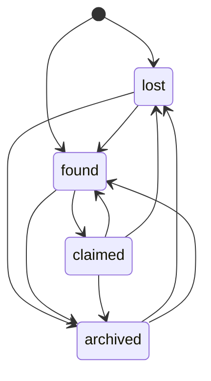

# Features

Anyone can browse. Creating content (items, listings, posts, comments) needs a **verified student**: an admin verifies the account after checking the student ID. Unverified users see a "verification required" page (HTTP 403).

## Accounts: `users`

| URL | Description |
|---|---|
| `/users/register/` | Username, email, first/last name, **student ID** (unique), password. Rate-limited to 5 POST/min per IP. |
| `/users/login/` | Login. Rate-limited to 10 POST/min per IP. Locked for 1 h after 5 failures (django-axes). |
| `/users/logout/` | Logout (POST). |
| `/users/dashboard/` | Personal dashboard. |
| `/users/profile/<id>/` | Public profile: avatar, bio, badges, points. |
| `/users/profile/edit/` | Edit name, email, student ID, bio, picture. |
| `/users/profile/remove-picture/` | Remove the avatar (POST). |

Admin: `StudentProfile` has **Verify / Unverify selected students** bulk actions and a verification badge column.

## Lost & Found: `lostfound`

| URL | Description |
|---|---|
| `/lostfound/` | List with search (`q`) and status filter, 12 per page. |
| `/lostfound/create/` | Report an item: "I lost" or "I found", with title, description, photo, location and date. |
| `/lostfound/<id>/` | Detail page and history timeline. |
| `/lostfound/<id>/status/` | Change status (owner or finder only). |
| `/lostfound/<id>/delete/` | Delete (owner or finder only). |

Status state machine:

Each change writes an `ItemHistory` entry, notifies the other party and writes an audit log entry.

## Marketplace: `marketplace`

| URL | Description |
|---|---|
| `/marketplace/` | Listings with search, category filter (books, electronics, clothing, furniture, services, other) and sort (newest, price ↑, price ↓). |
| `/marketplace/create/` | New listing (title, description, price in TND, category, photo). |
| `/marketplace/<id>/` | Detail page with a "Message seller" button. |
| `/marketplace/<id>/delete/` | Delete (seller only). |

## Help Wall: `social`

| URL | Description |
|---|---|
| `/social/` | Feed with like and comment counts, 15 per page. |
| `/social/create/` | New post, optionally **anonymous**. |
| `/social/<id>/` | Post with comments (comments can also be anonymous). |
| `/social/<id>/like/` | AJAX like/unlike toggle, returns JSON. |
| `/social/<id>/comment/` | Add a comment. |
| `/social/<id>/delete/`, `/social/comment/<id>/delete/` | Delete (author only). |

Anonymous posts and comments show "Anonymous" to everyone. The real author is kept for moderation (visible in `/admin/`).

## Messaging: `messaging`

| URL | Description |
|---|---|
| `/messaging/` | Inbox: conversations with last message and unread count. |
| `/messaging/start/?user=<id>` | Open or reuse a 1-to-1 conversation. |
| `/messaging/<id>/` | Chat view. |
| `/messaging/<id>/send/` | AJAX send: text and/or image (validated with Pillow, max 5 MB). |
| `/messaging/<id>/fetch/?after=<msg_id>` | AJAX polling every 3 s. Marks incoming messages as read. |

Only participants can read or post (403 otherwise).

## Notifications: `notifications`

Created automatically for **likes, comments, new messages, and item status changes**.

| URL | Description |
|---|---|
| `/notifications/` | Full list, 30 per page. |
| `/notifications/<id>/read/` | Mark as read and redirect to the target (internal links only). |
| `/notifications/mark-all-read/` | POST. |
| `/notifications/dropdown/` | JSON for the navbar dropdown (latest 10). |

The unread counters for notifications and messages appear on every page via context processors.

## Wallet & gamification: `wallet`

### Earning EPI-points

| Action | Points | To whom | Limit |
|---|---|---|---|
| Publish a Help Wall post | +1 | author | — |
| Comment on a post | +2 | commenter | 20 comments/min |
| Your post gets a comment | +3 | post author | — |
| Your post gets a like | +2 | post author | **once per (post, liker)** |
| Report a lost/found item | +5 | reporter | — |
| Mark an item as found | +10 | user who changed it | **once per item** |
| Mark an item as claimed | +15 | user who changed it | **once per item** |

### Badges

| Badge | Condition |
|---|---|
| 🌟 First Post | First Help Wall post |
| 🤝 Good Samaritan | Marked an item found or claimed |
| ⭐ Trustworthy Seller | 3+ marketplace listings |
| 💬 Active Helper | 10+ comments |
| 🎓 Top Tutor | 10+ likes received on own posts |

### Perks

`python manage.py seed_perks` loads 8 default perks: free coffee, extra printing, book loan extension, store discount, locker rental, study room, snack, EPI hoodie discount. Admins can edit cost, stock and active status in `/admin/`. Redemptions start as `pending` and the campus desk marks them `claimed`.

| URL | Description |
|---|---|
| `/wallet/` | Balance, last 30 transactions, redemptions, "how to earn" table. |
| `/wallet/perks/` | Perks shop. |
| `/wallet/perks/<id>/redeem/` | Redeem (POST, atomic). |
| `/wallet/leaderboard/` | Top 10 of the current month, plus the badge catalogue. |

## Security dashboard: `auditlog`

`/security/dashboard/` is superuser only. It shows logins (24 h), failed logins (24 h), registrations (7 d), locked accounts, the latest 50 audit entries, the latest 20 axes access attempts, and actions per type.

Logged actions: login, logout, login_failed, account_locked, register, profile_update, item_create / item_update / item_delete, listing_create / listing_delete, post_create / post_delete.

## Ops endpoints: `core`

| URL | Description |
|---|---|
| `/healthz/` | `{"status": "ok"}` if the app and DB respond. Used by Jenkins stage 7. |
| `/metrics` | Prometheus metrics (django-prometheus). Loopback only: Django refuses proxied requests and Nginx denies the path. |
