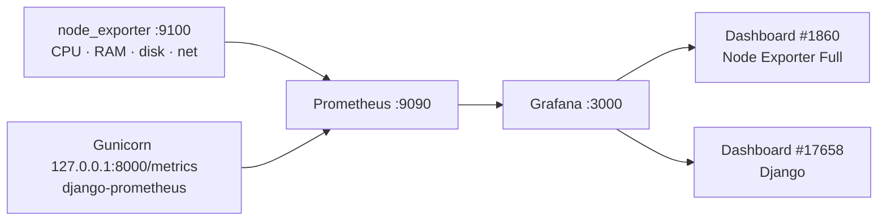

# Monitoring: Prometheus and Grafana



| Source | Metrics | Dashboard |
|---|---|---|
| node_exporter | `node_cpu_seconds_total`, `node_memory_*`, `node_filesystem_*`, `node_network_*` | **#1860 Node Exporter Full** |
| django-prometheus | `django_http_requests_total_by_view_transport_method`, `django_http_requests_latency_seconds_by_view_method`, `django_http_responses_total_by_status`, `django_db_execute_total`, `django_db_errors_total`, `django_cache_get_*`, `django_model_*` | **#17658 Django** |

## How the Django metrics are wired

- `django_prometheus` is in `INSTALLED_APPS`, with `PrometheusBeforeMiddleware` first and `PrometheusAfterMiddleware` last in `MIDDLEWARE`.
- The database engine is `django_prometheus.db.backends.postgresql` (a drop-in wrapper) and the cache is `django_prometheus.cache.backends.locmem.LocMemCache`. This is how DB and cache metrics are recorded.
- `/metrics` (`core.views.metrics`) answers only requests that come **directly** to Gunicorn on loopback without an `X-Real-IP` header, i.e. Prometheus on the same VM. Nginx additionally has `location = /metrics { deny all; }`.

## Installation on the VM

```bash
# Prometheus + node_exporter from Ubuntu packages
sudo apt install -y prometheus prometheus-node-exporter
sudo cp /var/www/EPIConnect/deploy/monitoring/prometheus.yml /etc/prometheus/prometheus.yml
promtool check config /etc/prometheus/prometheus.yml
sudo systemctl restart prometheus
# Targets: http://4.223.163.106:9090/targets → prometheus, node, django all UP

# Grafana OSS
sudo apt install -y apt-transport-https software-properties-common
sudo mkdir -p /etc/apt/keyrings
wget -q -O - https://apt.grafana.com/gpg.key | gpg --dearmor | sudo tee /etc/apt/keyrings/grafana.gpg > /dev/null
echo "deb [signed-by=/etc/apt/keyrings/grafana.gpg] https://apt.grafana.com stable main" | sudo tee /etc/apt/sources.list.d/grafana.list
sudo apt update && sudo apt install -y grafana

# Datasource provisioned as code (replaces the old API/Python workaround)
sudo cp /var/www/EPIConnect/deploy/monitoring/grafana/datasource.yml /etc/grafana/provisioning/datasources/prometheus.yml
sudo systemctl enable --now grafana-server
```

In Grafana (`http://4.223.163.106:3000`, admin IP only), change the default admin password, then **Dashboards → New → Import** → ID `1860` → datasource *Prometheus*, and repeat with ID `17658`.

> Memory: the VM has 1 GiB of RAM. Prometheus + Grafana + Jenkins + PostgreSQL + Gunicorn fit, but add swap to be safe:
> `sudo fallocate -l 2G /swapfile && sudo chmod 600 /swapfile && sudo mkswap /swapfile && sudo swapon /swapfile && echo '/swapfile none swap sw 0 0' | sudo tee -a /etc/fstab`

## Useful PromQL

| Question | Query |
|---|---|
| Requests per second | `sum(rate(django_http_requests_total_by_method_total[5m]))` |
| 5xx error rate | `sum(rate(django_http_responses_total_by_status_total{status=~"5.."}[5m]))` |
| p95 latency per view | `histogram_quantile(0.95, sum by (le, view) (rate(django_http_requests_latency_seconds_by_view_method_bucket[5m])))` |
| DB queries per second | `sum(rate(django_db_execute_total[5m]))` |
| Memory used % | `100 * (1 - node_memory_MemAvailable_bytes / node_memory_MemTotal_bytes)` |
| Disk used % on / | `100 * (1 - node_filesystem_avail_bytes{mountpoint="/"} / node_filesystem_size_bytes{mountpoint="/"})` |

## Note on Gunicorn workers

Each of the 3 Gunicorn workers keeps its own counters, and a scrape hits one worker at a time. The graphs show the right trends, but absolute totals are per worker. For exact totals, set `PROMETHEUS_MULTIPROC_DIR` (prometheus_client multiprocess mode). That isn't needed for this demo.
